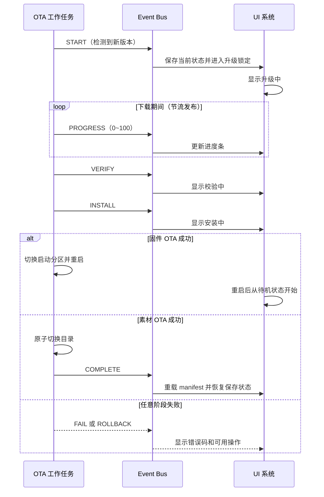

# Julia UI OTA 接入指南

本文面向 OTA 模块开发者，只定义接口契约、行为时序和数据格式，不提供下载、校验、安装或目录操作的 C 实现。

## 1. OTA 模块定位

OTA 是独立模块，与 UI 渲染系统完全解耦。OTA 不得直接调用渲染器、状态机、动画服务或 LCD 接口；OTA 仅通过事件总线发布进度和结果，UI 被动订阅并展示。下载、校验和安装在独立工作任务中执行，不得阻塞 UI 主循环，其任务优先级应低于 UI 渲染任务。

固件下载缓冲区和素材解压缓冲区不得复用 UI 帧缓冲。OTA 模块拥有下载资源及失败清理责任；UI 仅拥有展示状态。

## 2. 接口和版本

OTA 组需要包含：

- `julia_ota.h`：OTA 状态、错误码、快照和发布接口。
- `julia_event_bus.h`：事件类型与事件总线；仅在 OTA 需要订阅系统事件时使用。

当前两个契约版本均为 `1.0.0`。依赖方应检查 `JULIA_OTA_VERSION_MAJOR` 和 `JULIA_EVENT_BUS_VERSION_MAJOR`；主版本不一致时编译失败。次版本增加表示向下兼容功能，修订版本仅表示兼容修复。

启动顺序为：先初始化事件总线，再初始化 OTA 契约，随后注册 UI 订阅，最后启动 OTA 工作任务。当前事件总线采用同步回调且内部不加锁；OTA 发布会在 OTA 工作任务中执行所有订阅回调。OTA 组必须与其他订阅/发布操作进行外部串行化，回调不得阻塞、递归发布或保存载荷地址。

## 3. OTA 组实现职责

### 3.1 固件下载

- 从服务端下载固件 bin，直接流式写入当前未运行的 `ota_0` 或 `ota_1` 分区，不经过 SD 卡。
- 使用 OTA 自有下载缓冲区，限制网络重试和超时，不占用 UI 帧缓冲。
- 下载中按节流策略发布进度；建议百分比变化 5% 或间隔 1 秒时发布一次。

### 3.2 固件校验

- 计算完整固件 SHA-256，并与服务端可信摘要或签名校验结果比较。
- 校验失败时终止 OTA 写入、清理临时状态并发布校验类失败事件。
- 未通过校验的分区不得设置为启动分区。

### 3.3 固件安装

- 校验通过后调用 ESP-IDF 分区切换能力，将目标分区设置为下一启动分区。
- 发布安装阶段后完成必要持久化，再重启设备。
- 新固件首次启动应执行有效性确认；启动或自检失败时由 Bootloader 回退上一有效分区，并在系统可运行后报告回退结果。

### 3.4 素材下载与校验

- 下载素材压缩包或清单到临时目录，支持 ZIP 或 tar.gz 时必须保持包内相对目录结构。
- 解压后校验 `manifest.json` 的格式、版本和文件清单，并校验每个文件声明的 CRC 或 SHA。
- 任一文件失败即拒绝整包，清理临时目录并保留当前生产目录。

### 3.5 素材原子切换

- 校验通过后，将生产目录改名为带时间戳的备份目录。
- 将临时目录改名为生产目录；只有同一文件系统内的改名才能作为原子切换前提。
- 切换成功后发布完成事件，由 UI 在安全边界重新加载 manifest。
- 仅在新生产目录可读取后清理旧备份，始终保留最近两个有效版本。

### 3.6 错误处理

- 下载失败发布错误码 1，覆盖断网、超时和服务端错误。
- 摘要、签名、manifest 或文件校验失败发布错误码 2。
- 分区写入、空间、权限或目录切换失败发布错误码 3。
- 找不到有效旧版本或回退切换失败发布错误码 4。
- 失败事件只发布一次；失败后不得继续发布完成事件。

## 4. UI 发布接口契约

OTA 组通过 `julia_ota_publish()` 通知 UI。参数契约如下：

| 数据项 | 合法值与含义 |
|---|---|
| 升级类型 | `JULIA_OTA_FIRMWARE` 或 `JULIA_OTA_ASSET` |
| 当前阶段 | `JULIA_EVENT_OTA_START`、`PROGRESS`、`VERIFY`、`INSTALL`、`COMPLETE`、`FAIL` 或 `ROLLBACK` |
| 进度 | `0~100` 百分比；仅 `PROGRESS` 阶段有业务含义，必须单调不减 |
| 错误码 | 仅 `FAIL/ROLLBACK` 有业务含义，使用第 7 节定义 |
| 版本号 | 目标版本字符串，可为空；快照最多保留 31 字节并保证 NUL 结尾 |
| 消息 | 人类可读的状态或错误摘要，可为空；快照最多保留 95 字节并保证 NUL 结尾 |

合法调用返回 `ESP_OK`；阶段、类型或进度非法，以及事件总线未初始化时返回 `ESP_ERR_INVALID_ARG`。发布是同步操作，不执行 UI 绘制，但订阅回调会增加调用耗时。禁止从 ISR 调用。UI 自动订阅并响应，OTA 组不得触碰 UI 对象。

## 5. 事件时序

事件必须遵循开始、零到多个进度、校验、安装、终态的顺序。`COMPLETE`、`FAIL` 和本次流程的终止性 `ROLLBACK` 互斥，每次流程只能有一个终态。

## 6. 素材热更新约定

### 6.1 目录角色

| 角色 | 约定路径 | 内容 |
|---|---|---|
| 生产目录 | `/sdcard/julia/ui_delivery/` | 当前运行素材与 `manifest.json` |
| 临时目录 | `/sdcard/julia/ui_delivery_new/` | 下载、解压和校验中的完整候选版本 |
| 备份目录 | `/sdcard/julia/ui_delivery_backup_<timestamp>/` | 已验证的旧生产版本，时间戳用于排序 |

路径最终应由统一配置提供；表中路径是当前默认契约。临时目录、生产目录与备份目录必须位于同一文件系统。

### 6.2 原子切换步骤

1. 完整校验临时目录的 `manifest.json` 和全部文件 CRC/SHA。
2. 将生产目录改名为新的时间戳备份目录。
3. 将临时目录改名为生产目录。
4. 发布完成事件，UI 在停止旧素材读取后重新加载 manifest。
5. 删除超过保留上限的最旧备份，最近两个有效备份必须保留。

若步骤 3 失败，OTA 必须立即将步骤 2 的备份恢复为生产目录，并发布安装类失败事件。删除备份不得早于新生产目录切换成功。

### 6.3 回退步骤

1. 停止新素材加载，并找到时间戳最新且校验有效的备份。
2. 将当前生产目录移到隔离目录，避免覆盖唯一可诊断副本。
3. 将目标备份原子改名为生产目录。
4. 发布回退阶段或完成结果，UI 重新加载旧 manifest。
5. 回退失败时恢复可用目录并发布错误码 4。

### 6.4 清理策略

只保留最近两个通过校验的备份。清理按解析后的时间戳排序，不按目录枚举顺序；不得删除当前生产目录、临时下载仍在使用的目录或唯一有效备份。

## 7. 错误码

| 错误码 | 类别 | 含义 | 典型触发场景 |
|---:|---|---|---|
| 0 | 成功 | 无错误 | 正常阶段或正常完成 |
| 1 | 下载 | 下载失败 | 网络断开、超时、HTTP/服务端错误 |
| 2 | 校验 | 校验失败 | SHA 不匹配、签名无效、manifest 非法、文件损坏 |
| 3 | 安装 | 安装失败 | 分区写入错误、空间不足、权限错误、目录切换失败 |
| 4 | 回退 | 回退失败 | 旧分区不可用、备份不存在或备份损坏 |

人类可读的详细原因应同时记录在 OTA 模块日志中。事件消息只用于简短摘要，UI 的稳定文案和恢复操作仍必须按错误码映射，不能依赖任意日志字符串。

## 8. 调试与测试

OTA 组至少完成以下自测：

1. 模拟开始、多个单调进度、校验、安装和完成事件，确认 UI 阶段和进度正确。
2. 在下载、校验和安装各阶段模拟失败，确认只出现一个失败终态及正确错误码。
3. 在动画播放时切换素材，确认旧素材读取停止后才重载 manifest，且画面无损坏。
4. 测试素材步骤 2 成功但步骤 3 失败的恢复路径，确认生产目录仍可用。
5. 连续更新三个素材版本，确认仅保留最近两个有效备份，并可回退上一版。
6. 测试固件断电、摘要不匹配、首次启动自检失败和 Bootloader 回退。
7. 测量 OTA 期间 UI 帧率、堆内存和事件回调耗时，确认下载任务未阻塞 UI tick。

当前系统已提供 `ota status` 查询快照，以及非破坏性的 `ota mock reset` 和分阶段 `ota mock` 事件发布命令。`ota check`、`ota start firmware`、`ota start asset`、`ota cancel` 和真实 `ota rollback` 属于 OTA 组待接入命令，接入前不得将其写入测试脚本作为已实现能力。

## 9. 常见问题

**OTA 可以直接操作 LCD 显示下载进度吗？** 不能。OTA 只发布事件，所有显示均由 UI 负责。

**下载任务优先级如何设置？** 低于 UI 渲染任务，并通过分块 I/O、进度节流和有限重试控制 CPU 占用。

**素材压缩包格式有什么要求？** 可选择 ZIP 或 tar.gz，但解压后必须保持 manifest 声明的相对目录结构，且所有文件都需校验。

**固件 bin 下载到哪里？** 直接写入非当前 ESP32 OTA 分区，不经过 SD 卡，也不先写入 UI 素材目录。

**为什么发布接口不能直接从多个任务调用？** 当前快照与同步事件总线内部不加锁；OTA 组应使用单一工作任务或外部互斥保证串行化。

**UI 没响应事件时如何排查？** 依次确认事件总线已初始化、UI 已订阅对应类型、阶段和升级类型合法、发布返回 `ESP_OK`，再检查回调是否因阻塞或上下文错误未完成。

**素材完成后可以立即删除所有备份吗？** 不可以。必须保留最近两个有效版本，并在 UI 成功重载新 manifest 后再执行超限清理。

**失败后能继续沿用同一事件流程吗？** 不能。失败是终态；清理完成后需要新的 `START` 才能开始下一次升级。
